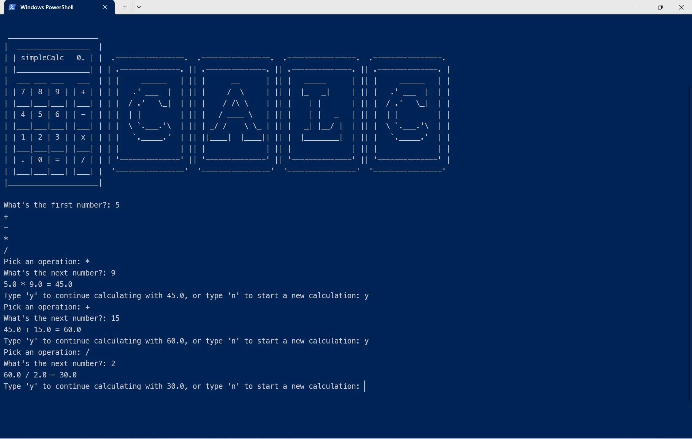

# simpleCalculator

simpleCalculator offers a simple and quick estimation making it easy for users of all levels to perform calculations easily.

## Features

From basic arithmetic operations to advanced mathematical functions, simpleCalculator has got you covered. Perform addition, subtraction, multiplication, and division.

## Screenshots 📸
 

## Requirements 🔧
 Python 3.12.3. or higher

## Installation🔌
1. Press the Fork button (top right of the page) to save a copy of this project on your account.

2. Download the repository files (project) from the download section or clone this project by typing in the bash the following command:

    git clone https://github.com/CoderValentina/simpleCalculator.git

3. Open it in Visual Studio Code.

4. Run the program :)

## Contributing 💡
If you'd like to contribute to this project and enhance it with new ideas, your pull request is greatly appreciated. If you encounter any issues, please don't hesitate to report them in the repository's issue section. Thank you!

## Thank you! 😊
Please ⭐️ this repo and share it with others.